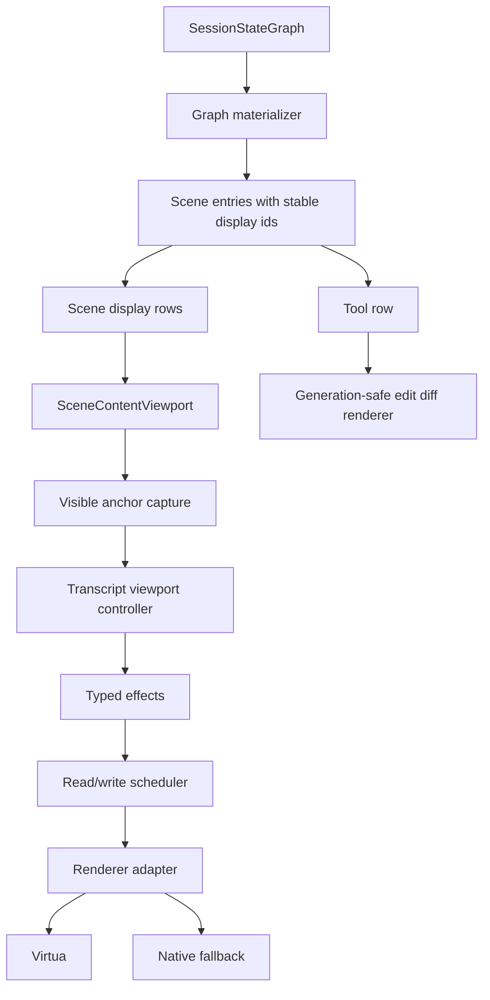

# fix: Finalize deterministic transcript viewport stability

## Overview

The deterministic transcript viewport refactor is marked complete, but live use still shows instability: scrolling can flicker near the top or bottom, edit tool diffs can disappear and reappear, and detached scrolling is not fully stable when tool rows resize.

This plan is a finalization pass over the refactor. It does not reopen the whole architecture. It closes the remaining proof gaps where the current implementation does not yet satisfy the May 13 plan's own invariants:

```text
scene rows
  -> stable display row identity
  -> real visible anchor capture
  -> pure viewport controller effects
  -> generation-safe DOM scheduler/renderers
  -> runtime proof with real Virtua behavior
```

The goal is a boring transcript viewport: no flicker, no surprise jumps while detached, no edit diff render races, and no row remounts caused by unresolved-to-resolved tool data.

## Problem Frame

The May 13 plan correctly moved the main transcript toward one scroll authority, but the live symptoms show three remaining holes:

- **Row identity is not stable enough.** A transcript tool row can first render as a pending/unresolved row keyed by the transcript entry id, then later render as an operation-backed tool row keyed by the provider tool-call id. If those ids differ, Virtua sees a different row and remounts it.
- **Anchor preservation is not real enough.** The current viewport stores an anchor key from the first anchor-eligible row summary, not the first visible row. `PreserveAnchor` also measures but does not actually compute and apply a preserving scroll offset.
- **Edit diff rendering is not generation-safe.** `AgentToolEditDiff` calls an async render path that can clean and rerender an imperative `@pierre/diffs` instance after a newer render has already started.

These bugs are easy to confuse with "Virtua is flaky", but the stronger diagnosis is that Acepe still gives Virtua unstable identity, incomplete anchor math, and an imperative child renderer that can race itself.

## Requirements Trace

- R1. Detached visual position must not jump when assistant output, tool output, edit diffs, thinking rows, or layout measurement changes occur below or around the visible viewport. Raw scroll offset may change when needed to compensate for content size changes above the visible anchor.
- R2. Following mode may keep the tail visible, but every tail reveal must still come from a typed controller effect.
- R3. Tool rows must keep one stable display-row key for their lifetime, even when canonical operation data arrives after a transcript placeholder.
- R4. Edit tool diffs must render deterministically; stale async renders must not clean or replace newer diff DOM.
- R5. Anchor preservation must use a real visible row anchor and a real pixel offset, not the first row in the transcript.
- R6. The main transcript must keep one production scroll authority. Old scroll helpers may remain only if they are test fixtures or dead historical code, not production participants.
- R7. Runtime proof must use the real Tauri app path or an equivalent real Virtua mount path, not only the current stubbed component tests.
- R8. No controller event, diagnostic, or plan-time fixture may store full message text.
- R9. Canonical graph/session state remains the semantic authority. This work must not add provider-specific viewport logic or client-side canonical fallback.
- R10. Implementation must be test-first or characterization-first because this area is already known fragile.

## Scope Boundaries

- In scope: main agent transcript viewport, display-row identity, visible anchor preservation, resize/follow behavior, edit tool diff rendering stability, viewport tests, diagnostics, and runtime proof.
- In scope: `@acepe/ui` edit tool rendering if needed to stop diff flicker.
- Out of scope: replacing Virtua.
- Out of scope: review-pane diff scrolling, project sidebar scrolling, file picker scrolling, browser-panel scrolling, or other non-transcript scroll surfaces.
- Out of scope: provider protocol changes, Rust session graph changes, or new canonical session fields.
- Out of scope: redesigning tool card visuals.

## Context & Research

### Relevant Code and Patterns

- `packages/desktop/src/lib/acp/components/agent-panel/components/scene-content-viewport.svelte`
  - Viewport shell. It builds display rows, handles `RowsChanged`, wires `VList`, falls back to native rendering, and dispatches public scroll commands. Before this finalization pass, it chose the anchor key through `getFirstAnchorKey`.
- `packages/desktop/src/lib/acp/components/agent-panel/logic/transcript-viewport-controller.ts`
  - Pure reducer for follow/detach, rows, renderer mode, and typed effects.
- `packages/desktop/src/lib/acp/components/agent-panel/logic/transcript-renderer-adapter.ts`
  - Adapter seam over Virtua/native fallback. It currently exposes measurements and scroll writes, but anchor measurement does not yet preserve a visible row's position.
- `packages/desktop/src/lib/acp/components/agent-panel/logic/transcript-viewport-scheduler.svelte.ts`
  - Frame scheduler. It currently batches read effects before write effects, but `PreserveAnchor` only checks whether the anchor exists.
- `packages/desktop/src/lib/acp/components/messages/message-wrapper.svelte`
  - Row wrapper and `ResizeObserver` owner. Today resize callbacks route through reveal-style behavior; final behavior needs a row-resize event that preserves anchor while detached.
- `packages/desktop/src/lib/acp/session-state/agent-panel-graph-materializer.ts`
  - Joins transcript rows to canonical operations. This is the right layer to preserve transcript-row identity while decorating rows with operation/tool data.
- `packages/desktop/src/lib/acp/components/agent-panel/scene/desktop-agent-panel-scene.ts`
  - Maps tool calls into shared scene entries. It currently uses the tool-call id as the scene entry id.
- `packages/ui/src/components/agent-panel/agent-tool-edit-diff.svelte`
  - Imperative `@pierre/diffs` renderer. It needs generation/cancellation protection so old async renders cannot clean newer DOM.
- `packages/ui/src/components/agent-panel/agent-tool-edit.svelte`
  - Owns the edit diff list and keys each diff by path/index. It should provide enough stable identity to keep each child diff renderer from remounting unnecessarily.
- `packages/desktop/src/lib/acp/components/agent-panel/components/__tests__/scene-content-viewport.svelte.vitest.ts`
  - Existing component tests around scroll, fallback, session switch, detached behavior, and resize behavior.
- `packages/desktop/src/lib/acp/components/agent-panel/logic/__tests__/transcript-viewport-controller.vitest.ts`
  - Pure controller tests.
- `packages/desktop/src/lib/acp/components/agent-panel/logic/__tests__/transcript-renderer-adapter.vitest.ts`
  - Adapter tests.
- `packages/desktop/src/lib/acp/components/agent-panel/logic/__tests__/transcript-viewport-scheduler.vitest.ts`
  - Scheduler tests.
- `packages/desktop/src/lib/acp/session-state/agent-panel-graph-materializer.test.ts`
  - Materializer tests for operation-backed tool rows and unresolved tool rows.
- `packages/ui/src/components/agent-panel/__tests__/agent-tool-edit-state.test.ts`
  - Existing edit tool state tests. Add a dedicated edit-diff rendering test beside this if needed.

### Institutional Learnings

- `docs/solutions/architectural/deterministic-transcript-viewport-controller-2026-05-13.md`
  - The main transcript must use one policy owner: scene rows -> controller -> typed effects -> scheduler -> renderer adapter.
- `docs/solutions/best-practices/agent-panel-content-viewport-reactivity-renderer-2026-05-01.md`
  - Viewport owns layout, scroll, virtualization, and fallback only. It must not invent row semantics.
- `docs/solutions/logic-errors/thinking-indicator-scroll-handoff-2026-04-07.md`
  - Reveal targeting and resize/growth tracking are different concerns. Synthetic rows can be valid reveal targets without being the right resize-observed row.
- `docs/solutions/ui-bugs/agent-panel-graph-materialization-rendering-bug-2026-04-28.md`
  - Transcript rows are the ordering spine; rich semantic data comes from canonical graph materialization.

### External References

- No external research used. This is a local finalization of an existing Acepe architecture, and the relevant standards are already captured in the May 13 plan and local solution docs.

## Key Technical Decisions

- **Stable row id is transcript-row identity.** For transcript-linked operations, the display row id should stay the transcript entry id. Operation/tool ids remain data fields, not virtualizer row keys.
- **Operation data decorates, not replaces, transcript rows.** The materializer should enrich the transcript row with canonical operation data while preserving the row's display identity.
- **Visible anchor beats transcript-first anchor.** Detached preservation must capture the first visible anchor-eligible row plus its offset from the viewport. The first row in the whole transcript is not a usable anchor.
- **`PreserveAnchor` must write when needed.** Measuring the anchor is not enough. The scheduler/adapter must compare before/after geometry and emit/apply the offset that keeps the anchor visually stable.
- **Resize is not reveal.** Row growth should dispatch a typed resize/preserve event. Reveal should remain reserved for explicit user/product intent such as send, panel activation, scroll-to-bottom, or follow.
- **Edit diff rendering must be cancellable.** Every async `@pierre/diffs` render attempt needs a generation guard. A stale render cannot clean up or replace the current instance.
- **Runtime proof is mandatory.** Stubbed Virtua tests are useful but not sufficient for this bug class. The final verification must observe real mounted rows, stable anchor viewport position, raw scroll offsets, and real diff DOM stability.

## Open Questions

### Resolved During Planning

- **Should this rewrite the May 13 plan?** No. The May 13 plan is complete and should remain historical. This plan is the finalization/fix plan for remaining live bugs.
- **Should we replace Virtua?** No. The current evidence points to Acepe identity, anchor, and imperative-renderer races. Replacing Virtua is out of scope unless implementation proves the adapter contract cannot be satisfied.
- **Should edit tool diff instability be treated as a viewport bug only?** No. It crosses the viewport boundary. The viewport can remount rows too often, but `AgentToolEditDiff` also has its own async race and must be hardened.
- **Should scroll state become canonical session state?** No. It remains local viewport state.
- **Should runtime proof depend on message text?** No. Use row keys, anchor viewport position, scroll offsets, row counts, effect names, and diff DOM presence/height. Avoid storing full transcript text.

### Deferred to Implementation

- **Exact visible-anchor capture mechanism for Virtua:** Use the smallest reliable Acepe adapter contract supported by real Virtua. Implementation may use Virtua item offset APIs, row DOM markers, or a narrow hybrid if tests prove it.
- **Exact runtime probe shape:** Implementation should use the available Tauri/MCP or equivalent browser path to capture visible row keys, anchor viewport positions, and scroll offsets. The plan defines required observations, not the exact script.
- **Whether old helper files are deleted or retained as archived tests:** Decide after production import checks. The invariant is no production scroll ownership outside the controller/scheduler path.

## High-Level Technical Design

> *This illustrates the intended approach and is directional guidance for review, not implementation specification. The implementing agent should treat it as context, not code to reproduce.*



### Anchor Contract

| State | Anchor source | Row resize behavior | Row changes behavior |
|---|---|---|---|
| Following | Tail | Reveal tail through typed effect | Reveal tail through typed effect |
| Detached | First visible anchor-eligible row plus pixel offset | Preserve visible anchor | Preserve visible anchor or nearest survivor |
| Explicit command | User/product command target | Command wins for that frame | Command wins for that frame |
| Composer submit | New turn/tail target from typed send event | Reveal new turn/tail once | Reveal new turn/tail once unless the user detaches during pending frames |

### Identity Contract

| Concept | Stable id source | Notes |
|---|---|---|
| Display row key | Transcript entry id for transcript rows | This is what Virtua keys and measures |
| Tool call id | Provider/canonical operation tool id | Used for tool semantics, not row identity |
| Operation id | Canonical operation id | Used for graph operation lookup, not row identity |
| Diff child key | Stable file/edit identity | Should avoid remounting the diff renderer when only status or parent row data changes |

## Implementation Units

- [x] **Unit 1: Characterize remaining live instability**

**Goal:** Turn the current flicker/diff disappearance into specific failing or diagnostic-backed tests before fixing behavior.

**Requirements:** R1, R4, R5, R7, R8, R10

**Dependencies:** None

**Files:**
- Modify: `packages/desktop/src/lib/acp/components/agent-panel/components/__tests__/scene-content-viewport.svelte.vitest.ts`
- Modify: `packages/desktop/src/lib/acp/components/agent-panel/logic/__tests__/transcript-viewport-controller.vitest.ts`
- Modify: `packages/desktop/src/lib/acp/components/agent-panel/logic/__tests__/transcript-viewport-scheduler.vitest.ts`
- Modify: `packages/desktop/src/lib/acp/components/agent-panel/logic/__tests__/transcript-renderer-adapter.vitest.ts`
- Create or modify: `packages/ui/src/components/agent-panel/__tests__/agent-tool-edit-diff.svelte.vitest.ts`

**Approach:**
- Add characterization coverage for detached viewport behavior when a tool/edit row changes height.
- Add coverage that proves `PreserveAnchor` currently does not preserve a visible anchor through a row height change.
- Add coverage that an edit diff renderer receiving two rapid render inputs cannot let the older render clean the newer DOM.
- Keep tests behavior-focused. Do not write source-text tests that assert implementation strings.

**Execution note:** Characterization-first. Start with failing tests for the observed instability, then continue directly into the fixing units.

**Patterns to follow:**
- Existing viewport tests in `packages/desktop/src/lib/acp/components/agent-panel/components/__tests__/scene-content-viewport.svelte.vitest.ts`
- Existing scheduler tests in `packages/desktop/src/lib/acp/components/agent-panel/logic/__tests__/transcript-viewport-scheduler.vitest.ts`

**Test scenarios:**
- Happy path: detached viewport receives a non-tail tool row resize -> no tail reveal effect is emitted.
- Edge case: detached viewport has rows inserted or replaced above the visible row -> the same visible anchor key remains visually stable.
- Edge case: edit diff component receives render input A, then input B before A's async setup finishes -> only B remains rendered.
- Integration: component viewport is detached, an edit tool row expands, and the recorded scroll call preserves position rather than revealing tail.

**Verification:**
- The tests fail against the current instability and describe the bug without relying on full message text.

- [x] **Unit 2: Stabilize transcript-linked tool row identity**

**Goal:** Ensure a transcript tool row keeps the same display row key before and after canonical operation data resolves.

**Requirements:** R3, R6, R8, R9

**Dependencies:** Unit 1

**Files:**
- Modify: `packages/desktop/src/lib/acp/session-state/agent-panel-graph-materializer.ts`
- Modify: `packages/desktop/src/lib/acp/components/agent-panel/components/agent-panel.svelte`
- Modify: `packages/desktop/src/lib/acp/components/agent-panel/scene/desktop-agent-panel-scene.ts`
- Modify: `packages/ui/src/components/agent-panel/types.ts`
- Modify: `packages/ui/src/components/agent-panel/agent-panel-conversation-entry.svelte`
- Test: `packages/desktop/src/lib/acp/session-state/agent-panel-graph-materializer.test.ts`
- Test: `packages/desktop/src/lib/acp/components/agent-panel/logic/__tests__/virtualized-entry-display.test.ts`

**Approach:**
- Separate display row identity from canonical tool/operation identity for transcript-linked operations.
- Keep `source_link.entry_id` as the scene/display id for rows rendered from transcript entries. Treat `entry.id` as display identity in shared UI rows.
- Preserve provider tool-call id, canonical operation id, and graph interaction id as explicit metadata where UI interactions need them. Use an explicit field such as `interactionId` for question/tool event routing instead of using the display id.
- Avoid fallback joins by tool-call id, title, or position. The join remains `OperationSnapshot.source_link`.
- Remove full transcript text from unresolved-tool diagnostics. Diagnostics may include entry id, segment count, text length, operation count, and state labels, but not segment text.

**Execution note:** Implement new domain behavior test-first.

**Patterns to follow:**
- `docs/solutions/ui-bugs/agent-panel-graph-materialization-rendering-bug-2026-04-28.md`
- `docs/solutions/logic-errors/operation-interaction-association-2026-04-07.md`

**Test scenarios:**
- Happy path: a transcript tool entry with a linked operation materializes to a rich edit/read/execute row whose display id equals the transcript entry id.
- Edge case: unresolved live tool row later receives linked operation data -> display row key stays unchanged while title/kind/details update.
- Edge case: child task operations keep their own stable child display ids without stealing the parent transcript row key.
- Edge case: interactive question/tool rows keep stable display ids while selection and action events still route through the canonical interaction id.
- Error path: unresolved-tool diagnostics are text-free and cannot include segment text or full message text.
- Error path: transcript tool with no operation remains a degraded/pending row keyed by the transcript entry id.
- Integration: `buildSceneDisplayRows` receives unresolved then resolved versions of the same transcript tool row -> `getSceneDisplayRowKey` returns the same key both times.

**Verification:**
- Tool row resolution no longer causes Virtua to treat the row as a different item.

- [x] **Unit 3: Make edit diff rendering generation-safe**

**Goal:** Stop stale async `@pierre/diffs` renders from cleaning or replacing newer edit diff DOM.

**Requirements:** R4, R10

**Dependencies:** Unit 1

**Files:**
- Modify: `packages/ui/src/components/agent-panel/agent-tool-edit-diff.svelte`
- Modify: `packages/ui/src/components/agent-panel/agent-tool-edit.svelte`
- Test: `packages/ui/src/components/agent-panel/__tests__/agent-tool-edit-diff.svelte.vitest.ts`

**Approach:**
- Introduce a render generation or equivalent cancellation guard around the async render path.
- Before cleaning an existing `FileDiff` instance, prove the render attempt is still current.
- Ensure component destroy cancels pending work and cleans only the instance owned by that component.
- Keep diff child keys stable enough that parent status changes do not remount the child renderer when file/edit content has not changed.

**Execution note:** Test-first around stale async render ordering.

**Patterns to follow:**
- Existing Svelte cleanup patterns in `packages/desktop/src/lib/components/ui/code-block/file-view.svelte.ts`
- Existing edit state tests in `packages/ui/src/components/agent-panel/__tests__/agent-tool-edit-state.test.ts`

**Test scenarios:**
- Happy path: one render input creates one rendered diff and cleans on destroy.
- Edge case: render A starts, render B starts before A finishes, A finishes last -> A does not clean or replace B.
- Edge case: only status changes from running to done with unchanged diff content -> diff DOM is not unnecessarily remounted.
- Error path: diff setup reports a render failure through the project-approved typed error path -> component shows a stable non-collapsing degraded state, preserves row height as much as possible, exposes a clear local status for accessibility, and does not loop.

**Verification:**
- Edit diff DOM does not disappear/reappear because of stale render cleanup.

- [x] **Unit 4: Implement real visible-anchor preservation**

**Goal:** Make detached scroll preservation use the visible row that the user is actually looking at.

**Requirements:** R1, R5, R7, R8, R10

**Dependencies:** Units 1 and 2

**Files:**
- Modify: `packages/desktop/src/lib/acp/components/agent-panel/components/scene-content-viewport.svelte`
- Modify: `packages/desktop/src/lib/acp/components/agent-panel/logic/transcript-renderer-adapter.ts`
- Modify: `packages/desktop/src/lib/acp/components/agent-panel/logic/transcript-viewport-controller.ts`
- Modify: `packages/desktop/src/lib/acp/components/agent-panel/logic/transcript-viewport-effects.ts`
- Modify: `packages/desktop/src/lib/acp/components/agent-panel/logic/transcript-viewport-events.ts`
- Test: `packages/desktop/src/lib/acp/components/agent-panel/logic/__tests__/transcript-renderer-adapter.vitest.ts`
- Test: `packages/desktop/src/lib/acp/components/agent-panel/logic/__tests__/transcript-viewport-controller.vitest.ts`
- Test: `packages/desktop/src/lib/acp/components/agent-panel/logic/__tests__/transcript-viewport-scheduler.vitest.ts`

**Approach:**
- Extend the adapter contract so it can capture the first visible anchor-eligible row, its pixel offset from the viewport, its old row index, and its previous/next eligible neighbor keys.
- Store that visible anchor on user scroll when detached.
- Make `PreserveAnchor` compare current anchor geometry against the stored offset and apply a scroll offset correction when content above the anchor changes.
- If the anchor row disappears, recover deterministically using the captured old index plus previous/next eligible neighbor keys. Prefer the nearest surviving neighbor around the old anchor position; if no neighbor survives, preserve the closest measured offset with a bounded diagnostic.

**Execution note:** Implement behavior test-first at the pure controller and adapter seams before wiring Svelte.

**Patterns to follow:**
- May 13 plan's "Anchor Contract" section in `docs/plans/2026-05-13-001-refactor-deterministic-transcript-viewport-plan.md`
- Existing adapter abstraction in `packages/desktop/src/lib/acp/components/agent-panel/logic/transcript-renderer-adapter.ts`

**Test scenarios:**
- Happy path: detached scroll captures visible row `row-50` with offset `12`; rows above grow; preserving effect applies the offset needed to keep `row-50` at the same viewport position.
- Edge case: captured anchor row is no longer present; nearest surviving anchor row is used and diagnostic is recorded.
- Edge case: captured anchor row is removed while both previous and next eligible neighbors remain; recovery chooses deterministically from the captured old-order context.
- Edge case: unresolved-to-resolved replacement happens near the visible row; anchor recovery does not jump to the first row in the new list.
- Edge case: content fits in viewport; no preserve write is emitted.
- Error path: adapter cannot measure visible rows; controller keeps detached state and emits a text-free diagnostic rather than revealing tail.
- Integration: Virtua adapter and native fallback adapter both satisfy the same visible-anchor contract in tests.

**Verification:**
- Detached viewport remains visually stable through row growth and row replacement.

- [x] **Unit 5: Split row resize from reveal intent**

**Goal:** Ensure resize observers preserve or follow correctly without treating every resize as an explicit reveal request.

**Requirements:** R1, R2, R5, R6, R10

**Dependencies:** Unit 4

**Files:**
- Modify: `packages/desktop/src/lib/acp/components/messages/message-wrapper.svelte`
- Modify: `packages/desktop/src/lib/acp/components/messages/logic/reveal-target-action-params.ts`
- Modify: `packages/desktop/src/lib/acp/components/messages/logic/reveal-resize-scheduler.ts`
- Modify: `packages/desktop/src/lib/acp/components/agent-panel/components/scene-content-viewport.svelte`
- Test: `packages/desktop/src/lib/acp/components/messages/logic/__tests__/reveal-target-action-params.test.ts`
- Test: `packages/desktop/src/lib/acp/components/agent-panel/logic/__tests__/transcript-viewport-controller.vitest.ts`
- Test: `packages/desktop/src/lib/acp/components/agent-panel/components/__tests__/scene-content-viewport.svelte.vitest.ts`

**Approach:**
- Route row growth to a typed `RowResized` event.
- In following mode, row resize can produce a tail reveal effect.
- In detached mode, row resize should preserve the visible anchor.
- Keep explicit reveal events only for send, panel activation, public scroll commands, or true upstream reveal intent.
- Treat delayed session-switch and historical-load bottom scrolls as cancellable reveal intents. If the user scrolls, wheels, or navigates before the delayed frame fires, the pending bottom reveal must be ignored.
- Composer submit is a typed reveal to the new turn/tail target, not a resize side effect. If the user detaches while the send reveal is pending, the detach wins.

**Execution note:** Characterize current resize behavior first, then narrow the event path.

**Patterns to follow:**
- `docs/solutions/logic-errors/thinking-indicator-scroll-handoff-2026-04-07.md`
- Current `RowResized` branch in `packages/desktop/src/lib/acp/components/agent-panel/logic/transcript-viewport-controller.ts`

**Test scenarios:**
- Happy path: while following, latest tool row resize emits one tail reveal effect.
- Happy path: while detached, latest tool row resize emits preserve-anchor behavior and no tail reveal.
- Edge case: controller receives `RowResized` in following and detached modes directly; the emitted effect matches the mode without needing a component-level assertion.
- Edge case: thinking row exists at the tail, but resize observation remains attached to the latest real growing row.
- Edge case: session switch or historical load schedules a delayed bottom reveal, then user scrolls before the delayed frame fires -> no bottom reveal is applied.
- Edge case: composer submit schedules a new-turn reveal, then user scrolls before the target appears -> user detach cancels the pending reveal.
- Integration: edit diff expansion while detached does not scroll to the user message, thinking row, or transcript tail.

**Verification:**
- Row resize no longer acts like a hidden user/product reveal command.

- [x] **Unit 6: Remove or quarantine old scroll authority residue**

**Goal:** Make the production scroll path obviously single-owner.

**Requirements:** R6, R9

**Dependencies:** Units 4 and 5

**Files:**
- Inspect and possibly remove: `packages/desktop/src/lib/acp/components/agent-panel/logic/create-auto-scroll.svelte.ts`
- Inspect and possibly remove: `packages/desktop/src/lib/acp/components/agent-panel/logic/thread-follow-controller.svelte.ts`
- Modify: `packages/desktop/src/lib/acp/components/agent-panel/logic/index.ts`
- Modify or remove tests as needed:
  - `packages/desktop/src/lib/acp/components/agent-panel/logic/__tests__/create-auto-scroll.test.ts`
  - `packages/desktop/src/lib/acp/components/agent-panel/logic/__tests__/thread-follow-controller.test.ts`

**Approach:**
- Confirm whether old helpers have any production imports.
- If production imports are gone, delete the old helper files and either delete their obsolete tests or move useful scenarios into the transcript viewport controller tests.
- If a helper still has a legitimate non-production use, mark it clearly as legacy/test-only and keep it out of exported production paths.

**Execution note:** Treat this as cleanup after behavioral fixes are green. Do not remove useful scenario coverage; move it to the new controller tests first.

**Patterns to follow:**
- May 13 plan invariant: old scroll controllers are not active parallel authorities.

**Test scenarios:**
- Integration: production import graph for the main transcript does not import old scroll controllers.
- Regression: key old helper scenarios, such as send-time thinking-row handoff and manual detach, remain covered by `transcript-viewport-controller` or `scene-content-viewport` tests.

**Verification:**
- A reader can inspect the production path and see one scroll authority without needing tribal knowledge.

- [ ] **Unit 7: Prove runtime behavior and document final invariants**

**Goal:** Verify the final behavior in the real app path and update durable docs with what was learned.

**Requirements:** R1-R10

**Dependencies:** Units 1-6

**Files:**
- Modify: `docs/solutions/architectural/deterministic-transcript-viewport-controller-2026-05-13.md`
- Create: `docs/solutions/ui-bugs/transcript-viewport-flicker-finalization-2026-05-14.md`
- Modify if needed: `docs/plans/2026-05-14-001-fix-transcript-viewport-finalization-plan.md`

**Approach:**
- Use the live Tauri app path or equivalent real Virtua mount to capture visible row keys, anchor viewport positions, raw scroll offsets, focus state, and diff DOM state across:
  - manual detach then incoming assistant/tool growth,
  - edit diff expansion,
  - unresolved tool row resolving into a rich operation-backed row,
  - send-time thinking row display,
  - delayed session-switch or historical-load bottom reveal with user detach during the pending frames,
  - scroll-to-bottom and scroll-to-top public commands.
- For flicker proof, record the anchor row's viewport position before the update, during the next several animation frames, and after layout settles. The anchored row should remain within 0-1 px unless a typed explicit reveal command wins that frame.
- Update solution docs with the final anchor/identity/diff-rendering invariants.
- Record runtime proof in `docs/solutions/ui-bugs/transcript-viewport-flicker-finalization-2026-05-14.md` under a `Runtime Proof` section. Include observed row keys, anchor viewport positions, raw scroll offsets, diff DOM presence/height, focus state, and the tested scenario names. Do not include full transcript text.
- Record any remaining issue as a new explicit follow-up plan only if it is outside this plan's scope.

**Execution note:** Runtime proof is required before marking this plan complete. Do not stop at stubbed component tests, and do not accept single-frame checks that can miss visible flicker.

**Patterns to follow:**
- Runtime proof contract in `docs/plans/2026-05-13-001-refactor-deterministic-transcript-viewport-plan.md`
- Existing solution-doc YAML style in `docs/solutions/`

**Test scenarios:**
- Integration: in a long session, scroll up to detach, allow a tool/edit row to update, and observe that visible anchor key and anchor viewport position remain stable; raw scroll offset may change to compensate for content above the anchor.
- Integration: edit diff content remains present over multiple animation frames after rapid row updates.
- Integration: unresolved tool row resolving does not change the row key observed by the viewport.
- Integration: focus remains stable or intentionally restored during row preservation, and degraded diff state exposes a clear accessible status.
- Integration: send while at bottom follows the thinking/tail row intentionally; send while detached follows only through the typed send/reveal event, never through resize side effects.

**Verification:**
- Component tests, pure reducer tests, adapter/scheduler tests, and runtime proof all agree on the same behavior.
- Documentation explains the final invariants in simple terms.

## System-Wide Impact

## Implementation Notes

Completed in this pass:

- Transcript-linked tool rows now keep transcript display identity while carrying separate canonical `toolCallId`, `operationId`, and `interactionId` metadata.
- Unresolved-tool diagnostics no longer include full transcript text.
- `AgentToolEditDiff` ignores stale async render attempts so an older diff render cannot clean or replace a newer one.
- The viewport now captures the first visible row anchor and its viewport offset for Virtua and native fallback paths.
- `PreserveAnchor` now applies a scroll correction when the anchor moved.
- Delayed historical/session-switch bottom reveals now check the current session, generation, and follow mode before running, so user detach wins.
- Detached row resize preserves the captured anchor; following row resize reveals tail through the controller.
- The old unused scroll helpers and their obsolete tests were removed after import checks confirmed they had no production references.

Verification completed:

- `bun test packages/desktop/src/lib/acp/session-state/__tests__/agent-panel-graph-materializer.test.ts`
- `bunx vitest run src/lib/acp/components/agent-panel/logic/__tests__/transcript-viewport-controller.vitest.ts src/lib/acp/components/agent-panel/logic/__tests__/transcript-viewport-scheduler.vitest.ts src/lib/acp/components/agent-panel/logic/__tests__/transcript-renderer-adapter.vitest.ts src/lib/acp/components/agent-panel/components/__tests__/scene-content-viewport.svelte.vitest.ts`
- `bunx vitest run --config vitest.config.ts src/components/agent-panel/__tests__/agent-tool-edit-diff.svelte.vitest.ts`
- `cd packages/desktop && bun run check`
- `cd packages/ui && bun run check`
- `cd packages/desktop && bun test`
- `cd packages/ui && bun test`

Runtime proof still needs a live Tauri MCP/browser session. From this shell, `http://localhost:1420` did not respond and no Tauri MCP resource was exposed, so Unit 7 remains open.

- **Interaction graph:** The work touches the main transcript render path, shared tool edit rendering, materialized scene entries, viewport scheduling, and runtime proof tooling.
- **Error propagation:** Diff render failures should remain local to the edit tool row. Anchor measurement failures should produce bounded diagnostics and must not silently reveal tail.
- **State lifecycle risks:** Stale render generations, stale session/generation scroll effects, and stale virtualizer row keys are the main lifecycle risks.
- **API surface parity:** If `AgentToolEntry` gains explicit display/tool identity fields, every shared renderer and task-child mapper that consumes `AgentToolEntry` must preserve them.
- **Integration coverage:** Unit tests alone are not enough. The real Virtua mount path must be checked because timing and measurement behavior differ from the stub.
- **Unchanged invariants:** Canonical graph state remains semantic authority. Viewport state remains local UI state. Provider-specific logic stays outside the viewport.

## Risks & Dependencies

| Risk | Likelihood | Impact | Mitigation |
|---|---:|---:|---|
| Visible-anchor capture is harder with Virtua than expected | Medium | High | Keep the adapter contract small, test real Virtua behavior, and stop for a separate renderer plan only if Virtua cannot satisfy it |
| Tool identity widening breaks question/tool interactions | Medium | High | Add explicit metadata tests and preserve semantic ids separately from display row ids |
| Edit diff generation guard hides real render errors | Low | Medium | Keep failures visible as local degraded state/diagnostics; do not swallow them silently |
| Cleanup deletes old tests that still cover real behavior | Medium | Medium | Move useful scenarios to controller/component tests before deleting old helper tests |
| Runtime proof becomes too manual | Medium | Medium | Capture row keys, anchor viewport positions, raw scroll offsets, focus state, and diff DOM state through a small repeatable diagnostic path rather than screenshot-only verification |

## Success Metrics

- No visible flicker or teleport when manually scrolling detached and rows update.
- Edit diffs stay mounted and visible across rapid row/status/theme updates.
- Unresolved-to-resolved tool rows keep the same display row key.
- `PreserveAnchor` has behavioral tests proving it applies a real offset correction.
- The production main transcript path has one scroll authority.
- Real app proof captures stable visible anchor keys and stable anchor viewport positions for the critical scenarios. Raw scroll offset may change when preserving content above the anchor requires it.

## Documentation / Operational Notes

- Update the deterministic transcript viewport solution doc after implementation.
- Add a focused solution doc for the final flicker/root-cause fix if the implementation confirms the diagnosis.
- Do not mark this plan complete until runtime proof is recorded in `docs/solutions/ui-bugs/transcript-viewport-flicker-finalization-2026-05-14.md`.

## Sources & References

- Origin plan: `docs/plans/2026-05-13-001-refactor-deterministic-transcript-viewport-plan.md`
- Related solution: `docs/solutions/architectural/deterministic-transcript-viewport-controller-2026-05-13.md`
- Related learning: `docs/solutions/best-practices/agent-panel-content-viewport-reactivity-renderer-2026-05-01.md`
- Related learning: `docs/solutions/logic-errors/thinking-indicator-scroll-handoff-2026-04-07.md`
- Related learning: `docs/solutions/logic-errors/operation-interaction-association-2026-04-07.md`
- Related previous plan: `docs/plans/2026-05-02-003-fix-agent-panel-send-reveal-regression-plan.md`
